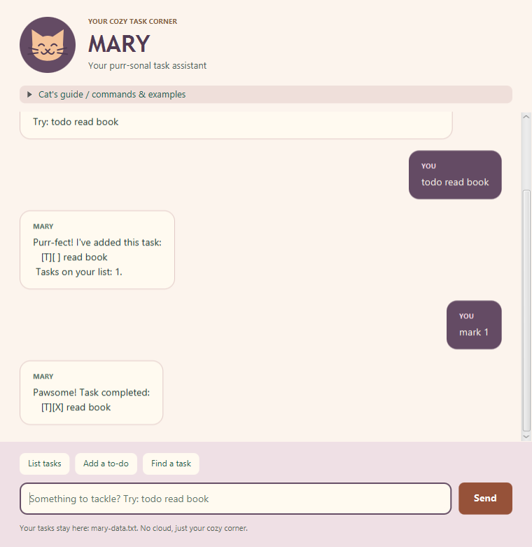

# MARY User Guide

Meet **MARY**, your purr-sonal task assistant! Keep to-dos, deadlines, and events
in one place with a few typed commands. No account or internet connection is needed.



## Get started

1. Install **Java 25** and obtain a copy of `mary.jar`.
   Building it yourself? See the [build instructions](../README.md#build-and-run-the-jar).
2. Put the JAR in a folder you can write to. Open a terminal in that folder and run:

   ```bash
   java -jar mary.jar
   ```

3. Type `todo read book` into the input box, then press **Enter** or click **Send**.
4. Type `list` to see your tasks. Purr-fect—you’re ready!

Expand **Cat's guide / commands & examples** for a quick reminder. Suggestion
buttons fill the input box; press Enter or Send to run the suggested command.

On Linux, the GUI needs a graphical desktop (or WSLg) and GTK 3. For a terminal-only
session, run `java -jar mary.jar --cli`; the commands below work there too.

## Add tasks

Enter one command at a time. Command words and markers such as `/by` are lowercase.
Replace the example descriptions and dates with your own; do not add quotation marks.

**To-do — no date attached:**

```text
todo read book
```

**Deadline — due at a particular date and time:**

```text
deadline return book /by 2/12/2026 1800
```

**Event — has both a start and an end:**

```text
event book club /from 2/12/2026 1400 /to 2/12/2026 1600
```

MARY confirms the addition and shows the task count. For example, in an empty list:

```text
Purr-fect! I've added this task:
  [T][ ] read book
Tasks on your list: 1.
```

Dates use **day/month/year** and times use **24-hour HHmm**, without a colon:
`2/12/2026 1800` means **2 December 2026, 6pm**. Deadlines and both event endpoints
need a date **and** time. Events may span several days, but the end must be strictly
later than the start. Words such as `tomorrow` are not supported.

## View and manage tasks

| What you want to do | Command example | What happens |
| --- | --- | --- |
| See every task | `list` | Displays the full list with task numbers. |
| Mark a task done | `mark 2` | Changes task 2 to `[X]`. |
| Mark it not done | `unmark 2` | Changes task 2 back to `[ ]`. |
| Delete a task | `delete 2` | Removes task 2 and shows the remaining count. There is no undo. |
| Search descriptions | `find book` | Finds descriptions containing `book`, including `notebook`, ignoring case. |
| Search by date | `on 2/12/2026` | Shows deadlines due that day and events spanning that day, including their start/end dates. To-dos are excluded. |
| Sort chronologically | `sort` | Orders deadlines by due time and events by start time, earliest first; to-dos go last. |
| End the session | `bye` | Shows a farewell. In the GUI, click **Close** afterward or close the window. |

In a list, `[T]` means to-do, `[D]` deadline, and `[E]` event.
`[X]` means done; `[ ]` means not done. For example, `1.[T][X] read book`
is completed task number 1.

**Use numbers from the latest `list` output when marking or deleting.** Search
results have their own numbering. Deleting or sorting can change full-list numbers.
Sorting preserves completion status and keeps equal-time tasks and to-dos in their
relative order. The new order is saved.

For phrase searches, use `find read book` without quotes. MARY looks for that whole
phrase in descriptions, not dates. No matches? Try a shorter keyword.

## Your tasks are saved automatically

Successful additions, deletions, status changes, and sorting are saved to
`mary-data.txt` in the **folder you launched MARY from**. Tasks reload on startup;
chat history is not saved. Closing the window directly is safe after a successful save.

- Launch from the same folder each time to see the same tasks.
- Use only one MARY instance at a time.
- To back up tasks, close MARY and copy `mary-data.txt` somewhere safe.
- Missing data files start an empty list. MARY creates the file when needed.
- All application writes stay in the launch folder or its subfolders. `.mary`
  contains local caches, not tasks; no home-folder storage fallback is used.

## If something goes wrong

MARY explains errors in the conversation; correct the input and try again.

- **Missing or repeated arguments:** include a description and the required date
  markers, each once. `list`, `sort`, and `bye` take no arguments.
- **Invalid task number:** run `list`, then use a positive whole number shown there.
- **Invalid date:** check the format above and use a real calendar date. An event
  cannot end at or before its start.
- **Duplicate task:** the same type, exact case-sensitive description, and dates
  already exist—even if that task is done. Use the existing task or change its details.
- **Unsupported characters:** do not put `|` or embedded line breaks/control characters
  in task descriptions. Ordinary punctuation and Unicode text are welcome.
- **Cannot save:** check folder permissions, free disk space, and programs locking
  the file. Failed saves leave the task list unchanged; retry after fixing the cause.
- **Cannot load:** MARY disables saving to protect the original file. Back it up,
  repair the reported problem or move the file aside, then restart. Moving it aside
  starts a new empty list; it does not recover the old tasks.

Extra spaces around commands and between command words and arguments are accepted.
If the GUI cannot start, read the terminal error and try `--cli`; on Linux, also
check that a graphical session is available.
